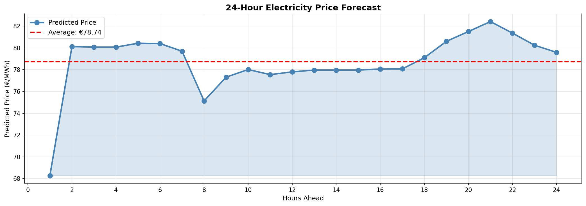

# German Electricity Price Forecasting

A machine learning pipeline for predicting day-ahead electricity prices in the German market using historical price data and engineered time-series features.


---

## Project Overview

Electricity prices in liberalized markets exhibit high volatility driven by supply-demand dynamics, renewable generation, and cross-border flows. Accurate price forecasting enables better decision-making for:

- **Energy traders**: Optimize bidding strategies in day-ahead markets
- **Grid operators**: Plan dispatch and reserve requirements
- **Large consumers**: Schedule flexible loads to minimize costs
- **Renewable generators**: Assess merchant revenue risk

This project builds a 24-hour-ahead price forecasting model for the Germany/Luxembourg bidding zone using data from ENTSO-E's Transparency Platform.

---

## Key Results

| Model | MAE (€/MWh) | RMSE (€/MWh) | R² | Improvement vs Baseline |
|-------|-------------|--------------|-----|-------------------------|
| Baseline (Lag-1) | — | — | — | — |
| Linear Regression | — | — | — | —% |
| Random Forest | — | — | — | —% |
| XGBoost | — | — | — | —% |

*Note: Fill in actual results after running the pipeline on your data.*

### Sample Forecast Output



---

## Project Structure

---

## Methodology

### 1. Data Source

Day-ahead electricity prices from [ENTSO-E Transparency Platform](https://transparency.entsoe.eu/) for the Germany/Luxembourg bidding zone.

**Why this dataset?**
- Publicly available and verifiable
- Hourly granularity suitable for day-ahead market analysis
- Well-documented with standardized format
- Reflects real market conditions including negative prices

### 2. Feature Engineering

Created 50+ features across six categories:

| Category | Features | Rationale |
|----------|----------|-----------|
| **Time features** | hour, day_of_week, month, quarter, is_weekend, is_night | Capture deterministic patterns (peak hours, weekday/weekend) |
| **Cyclical encoding** | hour_sin, hour_cos, month_sin, month_cos | Preserve circular continuity (hour 23 → 0) |
| **Lag features** | price_lag_1 to price_lag_168 | Autocorrelation structure of prices |
| **Rolling statistics** | mean, std, min, max, median (6h, 12h, 24h, 48h windows) | Recent trend and volatility |
| **Rate of change** | price_change_1h, price_change_24h, price_pct_change_24h | Momentum signals |
| **Volatility** | volatility_12, volatility_24, volatility_48, price_range | Market regime indicators |

### 3. Model Selection

| Model | Why Included |
|-------|--------------|
| **Baseline (Lag-1)** | Naive benchmark—any useful model must beat persistence |
| **Linear Regression** | Simple, interpretable; tests if relationships are linear |
| **Random Forest** | Handles non-linearity; robust to outliers; provides feature importance |
| **XGBoost** | State-of-the-art gradient boosting; often best performance on tabular data |

### 4. Evaluation Strategy

- **Chronological train-test split (80/20)**: Prevents data leakage inherent in random splits for time series
- **Multiple metrics**: MAE (interpretable), RMSE (penalizes large errors), R² (variance explained), MAPE (percentage error)
- **Residual analysis**: Check for systematic errors or heteroscedasticity

---

## Installation

### Prerequisites

- Python 3.8 or higher
- pip package manager

### Setup

```bash
# Clone the repository
git clone [github.com](https://github.com/yourusername/german-electricity-price-forecasting.git)
cd german-electricity-price-forecasting

# Create virtual environment (recommended)
python -m venv venv
source venv/bin/activate  # On Windows: venv\Scripts\activate

# Install dependencies
pip install -r requirements.txt

