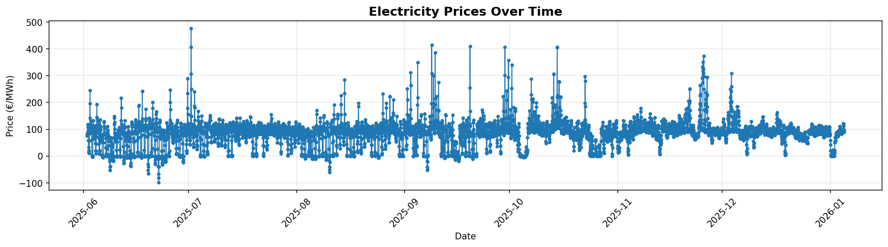
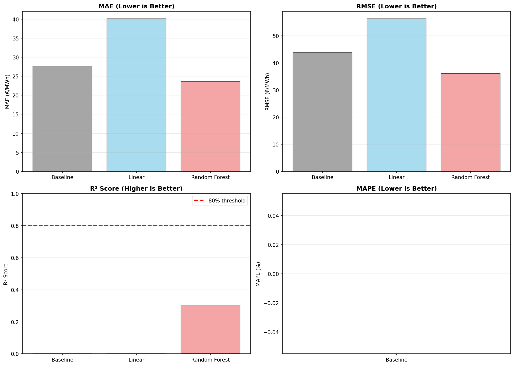
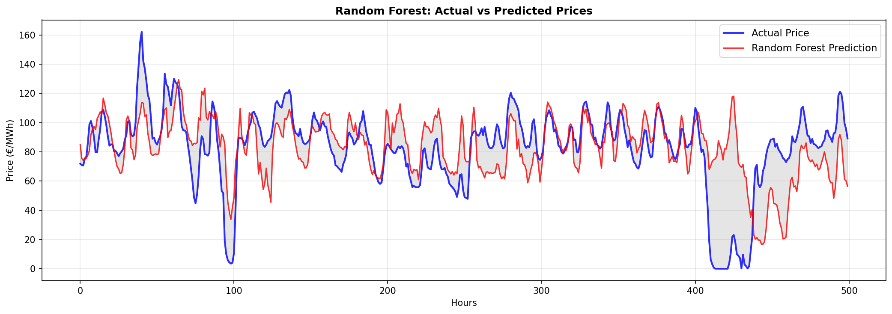

# ⚡ German Electricity Price Forecasting
### End-to-end ML pipeline · SMARD API · 24-hour ahead predictions · Random Forest


> Predict German electricity spot prices 24 hours ahead using publicly available SMARD market data, feature engineering, and machine learning.

---

## 📸 Project Visuals

| Plot | Description |
|------|-------------|
| `plots/01_timeseries.png` | Full price time series (Jun–Dec 2025) |
| `plots/02_hourly_pattern.png` | Average price by hour of day ± std |
| `plots/03_distribution.png` | Price distribution histogram |
| `plots/04_feature_correlation.png` | Top 15 features correlated with target |
| `plots/05_model_comparison.png` | MAE / RMSE / R² / MAPE across models |
| `plots/06_predictions_vs_actual.png` | Predicted vs actual prices (test set) |
| `plots/07_residuals_analysis.png` | Residual distribution + scatter |
| `plots/08_24hour_forecast.png` | 24-hour ahead forecast visualization |

**Time Series Overview**


**Model Comparison**


**Predictions vs Actual**


**24-Hour Forecast**


---

## 🎯 Project Goal

Electricity prices on the German EPEX SPOT market are highly volatile - influenced by renewable generation, cross-border flows, demand cycles, and weather. Accurate short-term price forecasting has direct commercial value for:

- **Energy traders** optimising buy/sell decisions
- **Industrial consumers** scheduling flexible loads
- **Grid operators** balancing supply/demand
- **Renewable asset owners** maximising revenue

This project builds a complete pipeline from raw API data to a deployed forecasting function, using only publicly available data from **[SMARD.de](https://www.smard.de)** - the official German electricity market transparency portal.

---

## 📊 Dataset

| Field | Value |
|-------|-------|
| **Source** | [SMARD.de](https://www.smard.de) - Federal Network Agency (Bundesnetzagentur) |
| **Series ID** | 4169 - Day-Ahead Auction prices (EPEX SPOT, Germany/Luxembourg) |
| **Granularity** | Hourly |
| **Period** | June 2025 - December 2025 |
| **Records** | 5,209 hourly observations |
| **Unit** | €/MWh |
| **Access** | Free, public REST API (no authentication required) |

**Why SMARD?**
- Official government data - no scraping, no terms-of-service concerns
- Real market prices (EPEX SPOT Day-Ahead Auction)
- Reflects Germany's complex grid: high renewables penetration, cross-border interconnections
- Data is granular enough for hour-level patterns while covering enough time for weekly/seasonal features

---

## 🔧 Feature Engineering

50 features across 7 categories:

| Category | Count | Examples |
|----------|-------|---------|
| Time features | 7 | `hour`, `day_of_week`, `is_weekend`, `is_night` |
| Cyclical encoding | 4 | `hour_sin`, `hour_cos`, `month_sin`, `month_cos` |
| Lag features | 9 | `price_lag_1`, `price_lag_24`, `price_lag_168` (1 week) |
| Rolling statistics | 20 | mean, std, min, max, median over 6/12/24/48h windows |
| Rate of change | 4 | `price_change_1h`, `price_change_24h`, `price_pct_change_24h` |
| Range features | 3 | `price_range_12`, `price_range_24`, `price_range_48` |
| Volatility | 3 | `volatility_12`, `volatility_24`, `volatility_48` |

**Target variable:** `price` shifted 24 hours forward → predicting tomorrow's price from today's data.

---

## 📈 Model Results

| Model | MAE (€/MWh) | RMSE (€/MWh) | R² | vs Baseline |
|-------|-------------|--------------|-----|-------------|
| **Baseline** (last known price) | 27.64 | 43.98 | -0.03 | — |
| Linear Regression | 40.08 | 56.27 | -0.69 | -45% ❌ |
| **Random Forest** ✅ | **23.55** | **36.10** | **0.30** | **+14.8%** |
| XGBoost | — | — | — | Not run* |

*XGBoost was not installed in the test environment. Install with `pip install xgboost` and it will run automatically in notebook 4.

**Top 5 Features by Importance (Random Forest):**
1. `price_lag_1` - 0.2975
2. `price_change_6h` - 0.1813
3. `price_lag_72` - 0.0452
4. `day_of_week` - 0.0373
5. `price_lag_168` - 0.0308

### ⚠️ Honest Limitations

**Linear Regression underperformed the baseline.** With 50 features, many of which are strongly correlated (multicollinearity), linear regression struggled. This is expected and is a good argument for tree-based methods in non-linear price data.

**MAPE = ∞ for all models.** The dataset contains near-zero or negative electricity prices (a real phenomenon in Germany during renewable oversupply - solar/wind can push prices below zero). Division by near-zero blows up MAPE. A robust metric like sMAPE should be used instead in future iterations.

**R² = 0.30 is a starting point.** 24-hour ahead price forecasting is genuinely hard. External regressors (solar/wind generation forecasts, temperature, cross-border flows) would significantly improve performance.

---

## 🚀 Quickstart

### 1. Clone and install

```bash
git clone https://github.com/YOUR_USERNAME/smard-electricity-forecast.git
cd smard-electricity-forecast
pip install -r requirements.txt
```

### 2. Run notebooks in order

```bash
jupyter notebook
```

Open and run sequentially:
1. `notebooks/01_data_collection.ipynb` → downloads data to `data/`
2. `notebooks/02_eda.ipynb` → generates plots 1–3
3. `notebooks/03_feature_engineering.ipynb` → generates `data/features.csv` + plot 4
4. `notebooks/04_modeling.ipynb` → trains models, saves to `models/`, generates plots 5–7
5. `notebooks/05_deployment.ipynb` → generates 24-hour forecast + plot 8

### 3. Use the prediction function directly

```python
from src.predict import load_model, make_prediction
import pandas as pd

df = pd.read_csv("data/electricity_prices_clean.csv")
df["timestamp"] = pd.to_datetime(df["timestamp"])

model, scaler, feature_names = load_model()

# Predict price 6 hours ahead
result = make_prediction(df, model, feature_names, hours_ahead=6)
print(f"Predicted price in 6h: €{result['predicted_price']:.2f}/MWh")
print(f"Change from current: {result['pct_change']:+.1f}%")
```

---

## 🛠️ Tech Stack

| Tool | Purpose |
|------|---------|
| `pandas` | Data manipulation |
| `numpy` | Numerical computing |
| `scikit-learn` | ML models, preprocessing, metrics |
| `xgboost` | Gradient boosting (optional) |
| `matplotlib` | Visualisation |
| `requests` | SMARD API client |
| `pickle` | Model serialisation |

---

## 🔮 Next Steps / Roadmap

- [ ] Add external features: solar/wind generation from SMARD (series IDs 125, 4066)
- [ ] Add temperature data via Open-Meteo API
- [ ] Implement LightGBM and compare with XGBoost
- [ ] Try LSTM / Temporal Fusion Transformer for sequence modelling
- [ ] Add walk-forward cross-validation (TimeSeriesSplit)
- [ ] Replace MAPE with sMAPE for robustness to near-zero prices
- [ ] Build a simple Streamlit dashboard for live forecasts

---

## 📄 License

MIT — free to use, modify, and share with attribution.

---

## 🙏 Acknowledgements

Data sourced from **SMARD** (Strommarktdaten), operated by the German Federal Network Agency (Bundesnetzagentur). All price data reflects official EPEX SPOT Day-Ahead Auction results.
